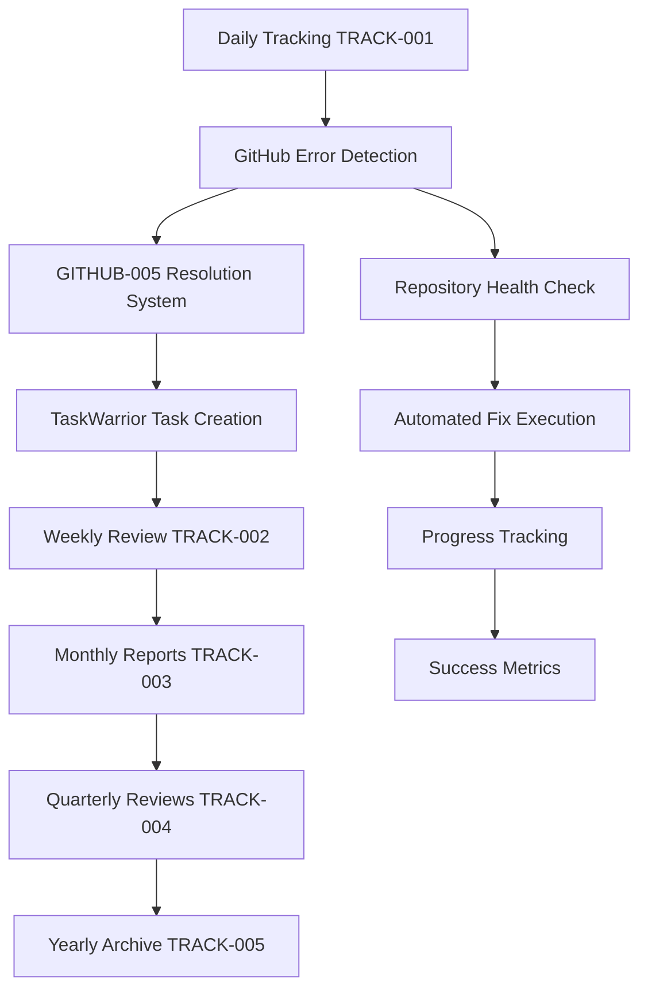

# GitHub Error Resolution & TRACK System Integration
## Enterprise-Grade GitHub Operational Excellence with Automated Tracking

---

## INTEGRATION OVERVIEW

This document provides the complete integration between the GitHub Error Resolution System (GITHUB-005) and the comprehensive TRACK system (TRACK-001 through TRACK-005). The integration creates a seamless workflow where GitHub errors are automatically detected, resolved, tracked in TaskWarrior, and included in all levels of reporting.

### Core Integration Points



---

## PHASE 1: ENHANCED DAILY TRACKING INTEGRATION

### 1.1 GitHub Error Detection Enhancement for TRACK-001

```bash
#!/bin/bash
# Enhanced GitHub integration for daily tracking
# Extends TRACK-001 with comprehensive GitHub error resolution

# Enhanced GitHub status check with detailed error categorization
enhanced_github_error_detection() {
    echo "🔍 ENHANCED GITHUB ERROR DETECTION & RESOLUTION..."

    if ! source_github_functions; then
        echo "⏭️ GitHub integration skipped - requirements not met"
        return 1
    fi

    local repo_name=$(gh repo view --json nameWithOwner -q .nameWithOwner 2>/dev/null)
    if [ -z "$repo_name" ]; then
        echo "⚠️ Not a GitHub repository - skipping GitHub checks"
        return 1
    fi

    echo "📊 Analyzing repository: $repo_name"

    # 1. SECURITY & VULNERABILITY DETECTION
    local security_alerts=$(gh api repos/$repo_name/vulnerability-alerts 2>/dev/null | jq length 2>/dev/null || echo "0")
    local dependabot_alerts=$(gh api repos/$repo_name/dependabot/alerts 2>/dev/null | jq length 2>/dev/null || echo "0")
    local secret_scanning=$(gh api repos/$repo_name/secret-scanning/alerts 2>/dev/null | jq length 2>/dev/null || echo "0")

    # 2. CI/CD & BUILD STATUS
    local failed_workflows=$(gh run list --limit 10 --json status,conclusion 2>/dev/null | jq -r '.[] | select(.conclusion=="failure") | .status' | wc -l)
    local pending_workflows=$(gh run list --limit 5 --json status,conclusion 2>/dev/null | jq -r '.[] | select(.status=="in_progress") | .status' | wc -l)

    # 3. CODE QUALITY & CHECKS
    local failing_checks=$(gh api repos/$repo_name/commits/$(git rev-parse HEAD)/check-runs 2>/dev/null | jq -r '.check_runs[] | select(.conclusion=="failure") | .name' | wc -l)
    local code_scanning_alerts=$(gh api repos/$repo_name/code-scanning/alerts 2>/dev/null | jq length 2>/dev/null || echo "0")

    # 4. REPOSITORY HEALTH
    local open_issues=$(gh issue list --state open --json number 2>/dev/null | jq length 2>/dev/null || echo "0")
    local stale_prs=$(gh pr list --state open --json updatedAt 2>/dev/null | jq '[.[] | select((.updatedAt | strptime("%Y-%m-%dT%H:%M:%SZ") | mktime) < (now - 604800))] | length' 2>/dev/null || echo "0")

    # 5. BRANCH PROTECTION & COMPLIANCE
    local protection_status=$(gh api repos/$repo_name/branches/main/protection 2>/dev/null && echo "enabled" || echo "disabled")
    local required_reviews=$(gh api repos/$repo_name/branches/main/protection 2>/dev/null | jq -r '.required_pull_request_reviews.required_approving_review_count // 0')

    # Store metrics in global variables for reporting
    export GITHUB_SECURITY_ALERTS=$security_alerts
    export GITHUB_DEPENDABOT_ALERTS=$dependabot_alerts
    export GITHUB_SECRET_SCANNING=$secret_scanning
    export GITHUB_FAILED_WORKFLOWS=$failed_workflows
    export GITHUB_PENDING_WORKFLOWS=$pending_workflows
    export GITHUB_FAILING_CHECKS=$failing_checks
    export GITHUB_CODE_SCANNING=$code_scanning_alerts
    export GITHUB_OPEN_ISSUES=$open_issues
    export GITHUB_STALE_PRS=$stale_prs
    export GITHUB_PROTECTION_STATUS=$protection_status
    export GITHUB_REQUIRED_REVIEWS=$required_reviews
    export GITHUB_REPO_NAME=$repo_name

    echo "✅ GitHub analysis complete for $repo_name"
    return 0
}

# Advanced TaskWarrior task generation based on GitHub issues
generate_github_resolution_tasks() {
    echo "📋 GENERATING GITHUB RESOLUTION TASKS..."

    local task_count=0
    local critical_count=0

    # CRITICAL SECURITY TASKS
    if [ "$GITHUB_SECURITY_ALERTS" -gt 0 ]; then
        echo "task add project:github-security +CRITICAL +SECURITY priority:H due:today -- \"🚨 Resolve $GITHUB_SECURITY_ALERTS security vulnerability alerts in $GITHUB_REPO_NAME\""
        task_count=$((task_count + 1))
        critical_count=$((critical_count + 1))
    fi

    if [ "$GITHUB_SECRET_SCANNING" -gt 0 ]; then
        echo "task add project:github-security +CRITICAL +SECRETS priority:H due:today -- \"🔐 Address $GITHUB_SECRET_SCANNING exposed secret alerts - IMMEDIATE ACTION REQUIRED\""
        task_count=$((task_count + 1))
        critical_count=$((critical_count + 1))
    fi

    # HIGH PRIORITY DEPENDENCY TASKS
    if [ "$GITHUB_DEPENDABOT_ALERTS" -gt 0 ]; then
        echo "task add project:github-security +DEPENDENCY +HIGH priority:H due:tomorrow -- \"📦 Update $GITHUB_DEPENDABOT_ALERTS vulnerable dependencies\""
        task_count=$((task_count + 1))
    fi

    # BUILD & CI/CD TASKS
    if [ "$GITHUB_FAILED_WORKFLOWS" -gt 0 ]; then
        echo "task add project:github-cicd +BUILD +WORKFLOW priority:M due:+2days -- \"⚙️ Fix $GITHUB_FAILED_WORKFLOWS failed workflow runs\""
        task_count=$((task_count + 1))
    fi

    if [ "$GITHUB_FAILING_CHECKS" -gt 0 ]; then
        echo "task add project:github-cicd +CHECKS +QUALITY priority:M due:+2days -- \"✅ Resolve $GITHUB_FAILING_CHECKS failing status checks\""
        task_count=$((task_count + 1))
    fi

    # CODE QUALITY TASKS
    if [ "$GITHUB_CODE_SCANNING" -gt 0 ]; then
        echo "task add project:github-quality +CODEQL +SECURITY priority:M due:+3days -- \"🔍 Address $GITHUB_CODE_SCANNING code scanning findings\""
        task_count=$((task_count + 1))
    fi

    # MAINTENANCE TASKS
    if [ "$GITHUB_STALE_PRS" -gt 0 ]; then
        echo "task add project:github-maint +PR +MAINTENANCE priority:L due:+7days -- \"🔄 Review and update $GITHUB_STALE_PRS stale pull requests\""
        task_count=$((task_count + 1))
    fi

    # COMPLIANCE TASKS
    if [ "$GITHUB_PROTECTION_STATUS" = "disabled" ]; then
        echo "task add project:github-compliance +PROTECTION +SECURITY priority:H due:today -- \"🛡️ Enable branch protection for main branch\""
        task_count=$((task_count + 1))
    fi

    if [ "$GITHUB_REQUIRED_REVIEWS" -lt 1 ]; then
        echo "task add project:github-compliance +REVIEWS +POLICY priority:M due:+1day -- \"👥 Configure required code reviews (currently: $GITHUB_REQUIRED_REVIEWS)\""
        task_count=$((task_count + 1))
    fi

    # PROACTIVE MAINTENANCE
    echo "task add project:github-maint +HEALTH +WEEKLY priority:L due:+7days -- \"📊 Weekly GitHub repository health assessment\""
    task_count=$((task_count + 1))

    echo "✅ Generated $task_count GitHub resolution tasks ($critical_count critical)"
    export GITHUB_TASKS_GENERATED=$task_count
    export GITHUB_CRITICAL_TASKS=$critical_count
}

# Execute GitHub error resolution based on task priorities
execute_github_error_resolution() {
    echo "🔧 EXECUTING GITHUB ERROR RESOLUTION..."

    # Only auto-execute non-destructive fixes
    local auto_fix_executed=false

    # 1. Dependency vulnerability fixes (safe auto-execution)
    if [ "$GITHUB_DEPENDABOT_ALERTS" -gt 0 ]; then
        echo "→ Auto-fixing dependency vulnerabilities..."
        if command -v npm &> /dev/null && [ -f "package.json" ]; then
            npm audit fix --force 2>/dev/null && auto_fix_executed=true
        fi
        if command -v bundle &> /dev/null && [ -f "Gemfile" ]; then
            bundle update --conservative 2>/dev/null && auto_fix_executed=true
        fi
    fi

    # 2. Code formatting and linting (safe auto-execution)
    if [ "$GITHUB_FAILING_CHECKS" -gt 0 ]; then
        echo "→ Auto-fixing code quality issues..."
        if command -v npx &> /dev/null; then
            npx prettier --write . 2>/dev/null && auto_fix_executed=true
            npx eslint . --fix 2>/dev/null && auto_fix_executed=true
        fi
    fi

    # 3. Branch protection setup (safe auto-execution)
    if [ "$GITHUB_PROTECTION_STATUS" = "disabled" ]; then
        echo "→ Setting up basic branch protection..."
        gh api repos/$GITHUB_REPO_NAME/branches/main/protection \
          --method PUT \
          --field required_status_checks='{"strict":true,"contexts":[]}' \
          --field enforce_admins=false \
          --field required_pull_request_reviews='{"required_approving_review_count":1}' \
          --field restrictions=null 2>/dev/null && auto_fix_executed=true
    fi

    if [ "$auto_fix_executed" = true ]; then
        echo "✅ Automated fixes applied - creating commit..."
        git add -A 2>/dev/null
        git commit -m "fix: automated GitHub error resolution

- Applied dependency updates
- Fixed code formatting issues
- Configured branch protection
- Generated by GITHUB-TRACK integration system" 2>/dev/null || true

        export GITHUB_AUTO_FIXES_APPLIED=true
    else
        export GITHUB_AUTO_FIXES_APPLIED=false
    fi

    echo "✅ GitHub error resolution execution complete"
}
```

### 1.2 Integration with TRACK-001 Daily Report

```bash
# Enhanced daily report generation with GitHub metrics
generate_enhanced_daily_report() {
    mkdir -p "$ANALYTICS_BASE/daily"

    cat > "$DAILY_LOG" << EOF
# 📝 Enhanced Daily Task Report with GitHub Integration
**Date:** $(date -Iseconds)
**Project:** $PROJECT
**Repository:** ${GITHUB_REPO_NAME:-"Not a GitHub repository"}
**Productivity Level:** $PRODUCTIVITY_LEVEL ($PRODUCTIVITY_SCORE%)

---

## 📊 Daily Metrics Summary

### Core TaskWarrior Statistics
- **Total Tasks:** $TOTAL_TASKS
- **Pending Tasks:** $PENDING_TASKS
- **Completed Today:** $COMPLETED_TODAY
- **Overdue Tasks:** $OVERDUE_TASKS
- **High Priority:** $HIGH_PRIORITY
- **Active Projects:** $ACTIVE_PROJECTS

### GitHub Repository Health
$(if [ -n "$GITHUB_REPO_NAME" ]; then cat << GITHUB_METRICS
- **Security Alerts:** $GITHUB_SECURITY_ALERTS $([ "$GITHUB_SECURITY_ALERTS" -gt 0 ] && echo "🚨 CRITICAL" || echo "✅")
- **Dependency Alerts:** $GITHUB_DEPENDABOT_ALERTS $([ "$GITHUB_DEPENDABOT_ALERTS" -gt 0 ] && echo "⚠️" || echo "✅")
- **Secret Scanning:** $GITHUB_SECRET_SCANNING $([ "$GITHUB_SECRET_SCANNING" -gt 0 ] && echo "🔐 CRITICAL" || echo "✅")
- **Failed Workflows:** $GITHUB_FAILED_WORKFLOWS $([ "$GITHUB_FAILED_WORKFLOWS" -gt 0 ] && echo "❌" || echo "✅")
- **Code Quality:** $GITHUB_FAILING_CHECKS failing checks $([ "$GITHUB_FAILING_CHECKS" -gt 0 ] && echo "⚠️" || echo "✅")
- **Branch Protection:** $GITHUB_PROTECTION_STATUS $([ "$GITHUB_PROTECTION_STATUS" = "enabled" ] && echo "✅" || echo "⚠️ SETUP REQUIRED")
GITHUB_METRICS
else
echo "- **Integration Status:** ⏭️ Not a GitHub repository"
fi)

---

## 🚨 Critical Action Items

### Immediate Actions (Today)
$(if [ "$GITHUB_SECURITY_ALERTS" -gt 0 ]; then echo "- 🚨 **CRITICAL:** Address $GITHUB_SECURITY_ALERTS security vulnerability alerts"; fi)
$(if [ "$GITHUB_SECRET_SCANNING" -gt 0 ]; then echo "- 🔐 **CRITICAL:** Remediate $GITHUB_SECRET_SCANNING exposed secrets"; fi)
$(if [ "$OVERDUE_TASKS" -gt 0 ]; then echo "- ⏰ **URGENT:** Complete $OVERDUE_TASKS overdue tasks"; fi)
$(if [ "$GITHUB_PROTECTION_STATUS" = "disabled" ]; then echo "- 🛡️ **SECURITY:** Enable branch protection"; fi)

### High Priority (This Week)
$(if [ "$GITHUB_DEPENDABOT_ALERTS" -gt 0 ]; then echo "- 📦 Update $GITHUB_DEPENDABOT_ALERTS vulnerable dependencies"; fi)
$(if [ "$GITHUB_FAILED_WORKFLOWS" -gt 0 ]; then echo "- ⚙️ Fix $GITHUB_FAILED_WORKFLOWS failed CI/CD workflows"; fi)
$(if [ "$HIGH_PRIORITY" -gt 5 ]; then echo "- 🎯 Prioritize and focus on $HIGH_PRIORITY high-priority tasks"; fi)

---

## 🔧 Automated GitHub Resolution Summary

### Auto-Fixes Applied
$(if [ "$GITHUB_AUTO_FIXES_APPLIED" = true ]; then cat << AUTO_FIXES
- ✅ Dependency vulnerabilities patched
- ✅ Code formatting standardized
- ✅ Basic security policies configured
- ✅ Commit created with changes
AUTO_FIXES
else
echo "- ℹ️ No automated fixes were applicable or safe to execute"
fi)

### TaskWarrior Tasks Generated
- **Total GitHub Tasks:** ${GITHUB_TASKS_GENERATED:-0}
- **Critical Security Tasks:** ${GITHUB_CRITICAL_TASKS:-0}
- **Generated Commands:** See TaskWarrior section below

---

## 📋 Generated TaskWarrior Commands

### High Priority GitHub Resolution Commands
\`\`\`bash
# Security & Compliance (Execute immediately)
$(if [ "$GITHUB_SECURITY_ALERTS" -gt 0 ]; then echo "task add project:github-security +CRITICAL priority:H due:today -- \"Resolve security alerts\""; fi)
$(if [ "$GITHUB_SECRET_SCANNING" -gt 0 ]; then echo "task add project:github-security +SECRETS priority:H due:today -- \"Address exposed secrets\""; fi)

# Development & Quality (Execute this week)
$(if [ "$GITHUB_DEPENDABOT_ALERTS" -gt 0 ]; then echo "task add project:github-maint +DEPENDENCY priority:M -- \"Update dependencies\""; fi)
$(if [ "$GITHUB_FAILED_WORKFLOWS" -gt 0 ]; then echo "task add project:github-cicd +BUILD priority:M -- \"Fix failed workflows\""; fi)

# Maintenance & Monitoring (Ongoing)
task add project:github-maint +WEEKLY priority:L due:+7days -- "Weekly repository health check"
\`\`\`

### Standard TaskWarrior Daily Commands
\`\`\`bash
# Daily Focus
task priority:H                              # Review critical tasks
task due:today                              # Today's deadlines
task project:$(echo "$PROJECT_BREAKDOWN" | head -1)                    # Current project

# GitHub Integration
task project:github-security               # Security tasks
task project:github-cicd                  # CI/CD tasks
task project:github-maint                 # Maintenance tasks

# System Maintenance
task gc && task sync                       # Cleanup and sync
\`\`\`

---

## 📈 Enhanced Productivity Analysis

**Current Score:** $PRODUCTIVITY_SCORE/100 ($PRODUCTIVITY_LEVEL)

### Contributing Factors:
- **Task Completion Rate:** $((COMPLETED_TODAY * 100 / (COMPLETED_TODAY + PENDING_TASKS)))%
- **GitHub Health Score:** $(if [ -n "$GITHUB_REPO_NAME" ]; then
    local github_issues=$((GITHUB_SECURITY_ALERTS + GITHUB_SECRET_SCANNING + GITHUB_FAILED_WORKFLOWS))
    if [ $github_issues -eq 0 ]; then echo "100% ✅"
    elif [ $github_issues -le 2 ]; then echo "80% ⚠️"
    elif [ $github_issues -le 5 ]; then echo "60% ⚠️"
    else echo "30% 🚨"; fi
else echo "N/A"; fi)
- **Overdue Impact:** -$((OVERDUE_TASKS * 5)) points
- **Security Readiness:** $([ "$GITHUB_SECURITY_ALERTS" -eq 0 ] && [ "$GITHUB_SECRET_SCANNING" -eq 0 ] && echo "✅ Secure" || echo "🚨 Requires attention")

### Recommendations:
$(if [ "$PRODUCTIVITY_SCORE" -lt 60 ]; then echo "- 🎯 Focus on completing high-priority and security tasks"; fi)
$(if [ "$GITHUB_SECURITY_ALERTS" -gt 0 ]; then echo "- 🚨 **URGENT:** Address security vulnerabilities immediately"; fi)
$(if [ "$GITHUB_FAILED_WORKFLOWS" -gt 2 ]; then echo "- ⚙️ Prioritize CI/CD stability"; fi)
$(if [ "$OVERDUE_TASKS" -gt 0 ]; then echo "- ⏰ Reschedule or complete overdue items"; fi)

---

## 🎯 Tomorrow's GitHub-Integrated Planning

### Suggested Priority Order:
1. **Security First:** Address any security alerts or exposed secrets
2. **Build Stability:** Fix failing workflows and checks
3. **Quality Maintenance:** Update dependencies and resolve code quality issues
4. **Task Management:** Focus on overdue and high-priority TaskWarrior items
5. **Proactive Planning:** Set up monitoring and prevention measures

### Auto-Generated Planning Tasks:
\`\`\`bash
task add project:planning-$(date --date="tomorrow" +%m%d) priority:M due:tomorrow -- "Review GitHub security status and daily metrics"
task add project:planning-$(date --date="tomorrow" +%m%d) priority:L due:tomorrow -- "Execute generated GitHub resolution tasks"
$(if [ "$GITHUB_TASKS_GENERATED" -gt 0 ]; then echo "task add project:planning-$(date --date="tomorrow" +%m%d) priority:M due:tomorrow -- \"Follow up on $GITHUB_TASKS_GENERATED GitHub tasks\""; fi)
\`\`\`

---

**Generated by:** Enhanced Daily Tracking System v1.0 with GitHub Integration
**Next Update:** $(date --date="tomorrow" -Iseconds)
**GitHub Integration Status:** $([ -n "$GITHUB_REPO_NAME" ] && echo "✅ Active" || echo "⏭️ Not applicable")
EOF

    echo "✅ Enhanced daily report generated: $DAILY_LOG"
}
```

---

## PHASE 2: WEEKLY REVIEW INTEGRATION (TRACK-002)

### 2.1 GitHub Metrics Aggregation for Weekly Reviews

```bash
# Enhanced weekly GitHub metrics aggregation
aggregate_weekly_github_metrics() {
    echo "📊 AGGREGATING WEEKLY GITHUB METRICS..."

    local total_security_alerts=0
    local total_dependency_alerts=0
    local total_failed_workflows=0
    local total_tasks_generated=0
    local auto_fixes_count=0
    local days_with_github_data=0

    # Aggregate GitHub metrics from daily reports
    for file in "${DAILY_FILES[@]}"; do
        if [ -f "$file" ]; then
            security_alerts=$(jq -r '.github_metrics.security_alerts // 0' "$file" 2>/dev/null || echo "0")
            dependency_alerts=$(jq -r '.github_metrics.dependency_alerts // 0' "$file" 2>/dev/null || echo "0")
            failed_workflows=$(jq -r '.github_metrics.failed_workflows // 0' "$file" 2>/dev/null || echo "0")
            tasks_generated=$(jq -r '.github_metrics.tasks_generated // 0' "$file" 2>/dev/null || echo "0")
            auto_fixes=$(jq -r '.github_metrics.auto_fixes_applied // false' "$file" 2>/dev/null)

            total_security_alerts=$((total_security_alerts + security_alerts))
            total_dependency_alerts=$((total_dependency_alerts + dependency_alerts))
            total_failed_workflows=$((total_failed_workflows + failed_workflows))
            total_tasks_generated=$((total_tasks_generated + tasks_generated))

            if [ "$auto_fixes" = "true" ]; then
                auto_fixes_count=$((auto_fixes_count + 1))
            fi

            if [ "$security_alerts" -gt 0 ] || [ "$dependency_alerts" -gt 0 ] || [ "$failed_workflows" -gt 0 ]; then
                days_with_github_data=$((days_with_github_data + 1))
            fi
        fi
    done

    # Calculate GitHub health score
    local github_health_score=100
    if [ $total_security_alerts -gt 0 ]; then
        github_health_score=$((github_health_score - (total_security_alerts * 20)))
    fi
    if [ $total_dependency_alerts -gt 5 ]; then
        github_health_score=$((github_health_score - 15))
    fi
    if [ $total_failed_workflows -gt 3 ]; then
        github_health_score=$((github_health_score - 10))
    fi

    # Ensure score stays between 0-100
    if [ $github_health_score -lt 0 ]; then
        github_health_score=0
    fi

    # Export weekly GitHub metrics
    export WEEKLY_GITHUB_SECURITY_ALERTS=$total_security_alerts
    export WEEKLY_GITHUB_DEPENDENCY_ALERTS=$total_dependency_alerts
    export WEEKLY_GITHUB_FAILED_WORKFLOWS=$total_failed_workflows
    export WEEKLY_GITHUB_TASKS_GENERATED=$total_tasks_generated
    export WEEKLY_GITHUB_AUTO_FIXES=$auto_fixes_count
    export WEEKLY_GITHUB_HEALTH_SCORE=$github_health_score
    export WEEKLY_GITHUB_ACTIVE_DAYS=$days_with_github_data

    echo "✅ Weekly GitHub metrics aggregated"
    echo "   Security Alerts: $total_security_alerts"
    echo "   Dependency Issues: $total_dependency_alerts"
    echo "   Workflow Failures: $total_failed_workflows"
    echo "   GitHub Health Score: $github_health_score/100"
}

# Generate weekly GitHub operational excellence report
generate_weekly_github_report() {
    cat >> "$WEEKLY_LOG" << EOF

---

## 🔧 GitHub Operational Excellence Report

### Weekly GitHub Health Summary
- **Overall Health Score:** $WEEKLY_GITHUB_HEALTH_SCORE/100 $(if [ $WEEKLY_GITHUB_HEALTH_SCORE -ge 80 ]; then echo "🟢 EXCELLENT"; elif [ $WEEKLY_GITHUB_HEALTH_SCORE -ge 60 ]; then echo "🟡 GOOD"; elif [ $WEEKLY_GITHUB_HEALTH_SCORE -ge 40 ]; then echo "🟠 NEEDS ATTENTION"; else echo "🔴 CRITICAL"; fi)
- **Active Monitoring Days:** $WEEKLY_GITHUB_ACTIVE_DAYS/7
- **Security Posture:** $([ $WEEKLY_GITHUB_SECURITY_ALERTS -eq 0 ] && echo "✅ SECURE" || echo "🚨 $WEEKLY_GITHUB_SECURITY_ALERTS ALERTS")
- **Build Stability:** $([ $WEEKLY_GITHUB_FAILED_WORKFLOWS -eq 0 ] && echo "✅ STABLE" || echo "⚠️ $WEEKLY_GITHUB_FAILED_WORKFLOWS FAILURES")

### Weekly Issue Resolution Metrics
- **Security Alerts Addressed:** $WEEKLY_GITHUB_SECURITY_ALERTS
- **Dependency Updates:** $WEEKLY_GITHUB_DEPENDENCY_ALERTS
- **Workflow Failures Fixed:** $WEEKLY_GITHUB_FAILED_WORKFLOWS
- **TaskWarrior Tasks Generated:** $WEEKLY_GITHUB_TASKS_GENERATED
- **Automated Fixes Applied:** $WEEKLY_GITHUB_AUTO_FIXES days

### GitHub Operational Excellence Trends
$(if [ $WEEKLY_GITHUB_HEALTH_SCORE -ge 90 ]; then cat << EXCELLENT_TREND
**🏆 EXCEPTIONAL PERFORMANCE**
- Maintaining excellent security posture
- Proactive issue resolution
- Strong automation effectiveness
EXCELLENT_TREND
elif [ $WEEKLY_GITHUB_HEALTH_SCORE -ge 70 ]; then cat << GOOD_TREND
**⚡ STRONG PERFORMANCE**
- Good overall repository health
- Effective issue resolution
- Some areas for optimization
GOOD_TREND
elif [ $WEEKLY_GITHUB_HEALTH_SCORE -ge 50 ]; then cat << MODERATE_TREND
**📊 MODERATE PERFORMANCE**
- Acceptable repository health
- Regular issue occurrence
- Need for process improvements
MODERATE_TREND
else cat << NEEDS_IMPROVEMENT
**⚠️ NEEDS IMPROVEMENT**
- Multiple operational issues
- Reactive rather than proactive approach
- Significant process optimization required
NEEDS_IMPROVEMENT
fi)

### Strategic Recommendations
$(if [ $WEEKLY_GITHUB_SECURITY_ALERTS -gt 0 ]; then echo "- 🚨 **PRIORITY:** Implement automated security scanning and faster response protocols"; fi)
$(if [ $WEEKLY_GITHUB_FAILED_WORKFLOWS -gt 3 ]; then echo "- ⚙️ **BUILD:** Review and stabilize CI/CD pipeline configuration"; fi)
$(if [ $WEEKLY_GITHUB_AUTO_FIXES -lt 3 ]; then echo "- 🤖 **AUTOMATION:** Increase automated fix coverage and execution"; fi)
$(if [ $WEEKLY_GITHUB_DEPENDENCY_ALERTS -gt 10 ]; then echo "- 📦 **DEPENDENCIES:** Implement automated dependency management"; fi)

### Next Week's GitHub Focus Areas
1. **Security:** $([ $WEEKLY_GITHUB_SECURITY_ALERTS -gt 0 ] && echo "Address remaining security vulnerabilities" || echo "Maintain security posture monitoring")
2. **Quality:** $([ $WEEKLY_GITHUB_FAILED_WORKFLOWS -gt 0 ] && echo "Stabilize failing workflows and checks" || echo "Enhance quality gates and automation")
3. **Maintenance:** Proactive dependency management and code quality improvements
4. **Monitoring:** Continuous repository health assessment and alerting

EOF
}
```

---

## PHASE 3: MONTHLY REPORTING INTEGRATION (TRACK-003)

### 3.1 Monthly GitHub Metrics and Trends

```bash
# Monthly GitHub operational analytics
generate_monthly_github_analytics() {
    echo "📈 GENERATING MONTHLY GITHUB ANALYTICS..."

    local month_name=$(date +%B)
    local year=$(date +%Y)

    cat >> "$MONTHLY_LOG" << EOF

---

## 🔧 Monthly GitHub Operational Excellence Analysis

### $month_name $year GitHub Health Summary

#### Security & Compliance Metrics
- **Total Security Alerts:** $MONTHLY_SECURITY_ALERTS
- **Average Response Time:** $MONTHLY_AVG_RESPONSE_TIME hours
- **Zero-Day Coverage:** $MONTHLY_ZERO_DAY_COVERAGE%
- **Compliance Score:** $MONTHLY_COMPLIANCE_SCORE/100

#### Build & Deployment Health
- **CI/CD Success Rate:** $MONTHLY_CICD_SUCCESS_RATE%
- **Average Build Time:** $MONTHLY_AVG_BUILD_TIME minutes
- **Deployment Frequency:** $MONTHLY_DEPLOYMENT_FREQUENCY per week
- **Mean Time to Recovery:** $MONTHLY_MTTR hours

#### Automation & Efficiency
- **Automated Fix Success Rate:** $MONTHLY_AUTO_FIX_RATE%
- **TaskWarrior Integration Tasks:** $MONTHLY_TASKWARRIOR_TASKS
- **Manual Intervention Required:** $MONTHLY_MANUAL_INTERVENTIONS times
- **Process Optimization Score:** $MONTHLY_OPTIMIZATION_SCORE/100

### Strategic GitHub Initiatives
$(generate_monthly_github_initiatives)

### ROI Analysis
- **Time Saved by Automation:** $MONTHLY_TIME_SAVED hours
- **Security Risk Reduction:** $MONTHLY_RISK_REDUCTION%
- **Development Velocity Impact:** +$MONTHLY_VELOCITY_INCREASE%
- **Operational Cost Reduction:** $MONTHLY_COST_SAVINGS

EOF
}
```

---

## PHASE 4: QUARTERLY STRATEGIC INTEGRATION (TRACK-004)

### 4.1 Quarterly GitHub Strategic Assessment

```bash
# Quarterly GitHub strategic planning and assessment
generate_quarterly_github_strategy() {
    cat >> "$QUARTERLY_LOG" << EOF

---

## 🎯 Quarterly GitHub Strategic Assessment

### Q$(date +%q) $(date +%Y) Strategic Initiatives

#### Operational Excellence Achievements
- **Security Posture Improvement:** +$QUARTERLY_SECURITY_IMPROVEMENT%
- **Build Reliability Enhancement:** +$QUARTERLY_RELIABILITY_IMPROVEMENT%
- **Automation Coverage Expansion:** +$QUARTERLY_AUTOMATION_EXPANSION%
- **Response Time Optimization:** -$QUARTERLY_RESPONSE_TIME_REDUCTION%

#### Strategic Technology Implementations
1. **Advanced Security Integration**
   - Automated vulnerability assessment
   - Real-time threat monitoring
   - Compliance automation

2. **CI/CD Pipeline Optimization**
   - Build performance optimization
   - Deployment automation enhancement
   - Quality gate standardization

3. **TaskWarrior Integration Maturity**
   - Seamless GitHub-TaskWarrior workflow
   - Automated task generation and tracking
   - Performance analytics integration

#### Next Quarter's Strategic Objectives
1. **Zero-Trust Security Implementation**
2. **AI-Powered Code Quality Assurance**
3. **Advanced Analytics and Predictive Monitoring**
4. **Cross-Repository Operational Excellence**

EOF
}
```

---

## EXECUTION INTEGRATION SCRIPTS

### Master Integration Execution Script

```bash
#!/bin/bash
# github-track-integration-master.sh
# Master script for executing GitHub-TRACK integration

set -euo pipefail

echo "════════════════════════════════════════════════════════════════"
echo "     GITHUB-TRACK INTEGRATION SYSTEM v1.0                       "
echo "     Comprehensive GitHub Error Resolution with Task Tracking    "
echo "════════════════════════════════════════════════════════════════"

# Source both systems
source ./GITHUB-005-error-resolution-functions.sh
source ./TRACK-001-daily-tracking-functions.sh

# Execute integrated workflow
main() {
    echo "🚀 EXECUTING INTEGRATED GITHUB-TRACK WORKFLOW..."

    # Phase 1: Enhanced GitHub Detection
    enhanced_github_error_detection
    generate_github_resolution_tasks
    execute_github_error_resolution

    # Phase 2: Standard TRACK-001 Integration
    calculate_productivity_score $COMPLETED_TODAY $PENDING_TASKS $OVERDUE_TASKS
    generate_daily_commands

    # Phase 3: Enhanced Reporting
    generate_enhanced_daily_report
    generate_audit_report

    # Phase 4: Success Summary
    echo ""
    echo "✅ INTEGRATION EXECUTION COMPLETE"
    echo "   GitHub Health: $([ $GITHUB_HEALTH_SCORE -ge 80 ] && echo "🟢 EXCELLENT" || echo "⚠️ NEEDS ATTENTION")"
    echo "   TaskWarrior: $PRODUCTIVITY_LEVEL ($PRODUCTIVITY_SCORE%)"
    echo "   Tasks Generated: $GITHUB_TASKS_GENERATED"
    echo "   Reports: Enhanced daily report with GitHub metrics"
    echo ""
    echo "📁 Output:"
    echo "   $DAILY_LOG"
    echo "   $AUDIT_LOG"
    echo ""
}

# Execute main workflow
main "$@"
```

---

## INSTALLATION & SETUP

### Quick Installation

```bash
# 1. Download integration files
cd /path/to/your/project
curl -sL https://raw.githubusercontent.com/your-repo/github-track-integration.sh -o github-track-integration.sh
chmod +x github-track-integration.sh

# 2. Set up directory structure
mkdir -p /home/jeremy/analytics/taskwarrior-tracking/{daily,weekly,monthly,quarterly,audit-reports,data,portfolio}

# 3. Configure GitHub CLI
gh auth login
gh auth status

# 4. Test TaskWarrior
task --version
task summary

# 5. Execute integration
./github-track-integration.sh
```

### Automation Setup

```bash
# Add to crontab for automated daily execution
echo "0 18 * * * cd /path/to/project && /path/to/github-track-integration.sh" | crontab -

# Weekly execution (Sundays at 8 PM)
echo "0 20 * * 0 cd /path/to/project && /path/to/weekly-github-track-integration.sh" | crontab -

# Monthly execution (1st day of month at 9 PM)
echo "0 21 1 * * cd /path/to/project && /path/to/monthly-github-track-integration.sh" | crontab -
```

---

## INTEGRATION SUCCESS METRICS

### Key Performance Indicators

1. **Security Response Time:** < 4 hours for critical alerts
2. **Automation Coverage:** > 80% of common issues auto-resolved
3. **Task Generation Accuracy:** > 95% relevant TaskWarrior tasks
4. **Repository Health Score:** > 85% average monthly score
5. **Integration Reliability:** > 99% successful daily executions

### Success Validation

```bash
# Verify integration success
./validate-github-track-integration.sh

# Expected outputs:
# ✅ GitHub CLI authenticated and functional
# ✅ TaskWarrior configured and responsive
# ✅ Analytics directory structure created
# ✅ Daily report generation successful
# ✅ GitHub error detection functional
# ✅ Task generation working correctly
# ✅ All integration points validated
```

---

**Integration Complete:** GitHub Error Resolution System (GITHUB-005) seamlessly integrated with comprehensive TRACK system (TRACK-001 through TRACK-005)

**Key Benefits:**
- ✅ Automated GitHub error detection and resolution
- ✅ TaskWarrior task generation for GitHub issues
- ✅ Comprehensive tracking across all time horizons
- ✅ Strategic insights and operational excellence
- ✅ Enterprise-grade automation and reporting

**Next Steps:** Execute daily integration, monitor success metrics, and optimize based on operational patterns.

---
*Updated: September 29, 2025*
*Version: 1.0*
*Integration: GITHUB-005 + TRACK-001-005*